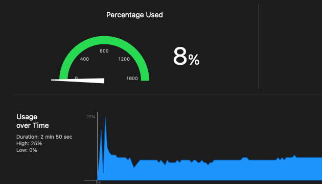

# VitalSignView

Vitalsignview is a component for drawing continues sign like medical monitor's display in IOS devices


cpu usage for drawing of 6 seconds period , 720 data per second



# Example

To run the example project, clone the repo, and run `pod install` from the Example directory first.

# Installation

VitalSignView is available through [CocoaPods](https://cocoapods.org). To install
it, simply add the following line to your Podfile:

```ruby
pod 'VitalSignView'
```

You can also clone the repo and copy from swift files, which in Source directory to your project

# Usage

Code usage; create an instance of VitalSignView. With VitalSignView config builder, you can make customizations

```swift
vitalSignView.setConfig(VitalSignView.Config.Builder()
                                    .setDataFrequency(hertz: 720.0)
                                    .setVisibleSignTimeInterval(seconds: 6)
                                    .setPaddingVertical(8.0)
                                    .setSignLineWidth(1.0)
                                    .setBackgroundColor(.black)
                                    .setSignColor(.green)
                                    .build())
```

Then start drawing
```swift
vitalSignView.start()
```
start sending data between -1 and 1

```swift
vitalSignView.sendData(d: data)
```

lastly, don't forget to invalidate vitalSignView after done with it

```swift
vitalSignView.invalidate()
```


In interface builder, add a uiview and change class to VitalSignView. In the attributes inspector, you can change configurations


| Attribute | Type  |  Default value |
|----|---|--|
| dataFrequency| Double | 1.0 |
| visibleSignTimeInterval | Double | 1.0 |
| signColor | UIColor | UIColor.green |
| backgroundColor | UIColor | UIColor.black |
| cursorColor | UIColor | backgroundColor |
| paddingVertical | CGFloat | 8.0 |
| signLineWidth | CGFloat | 1.0|


# Author

Savaş Salihoğlu , mustafasavassalihoglu@gmail.com

# License

VitalSignView is available under the MIT license. See the LICENSE file for more info.
